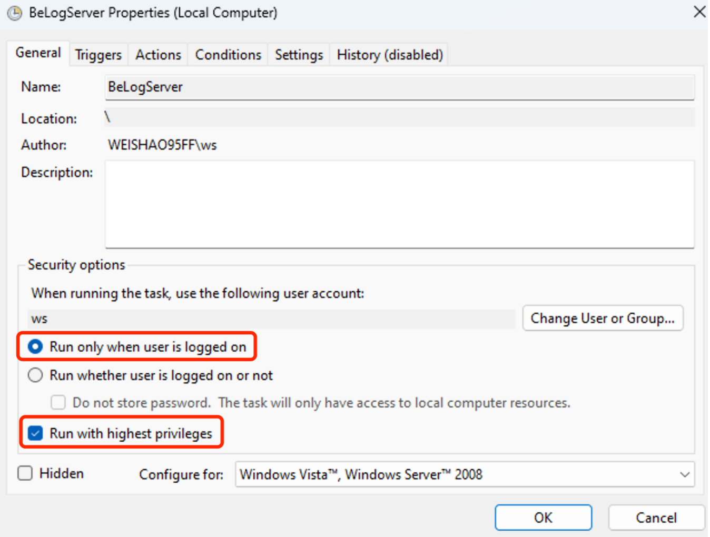
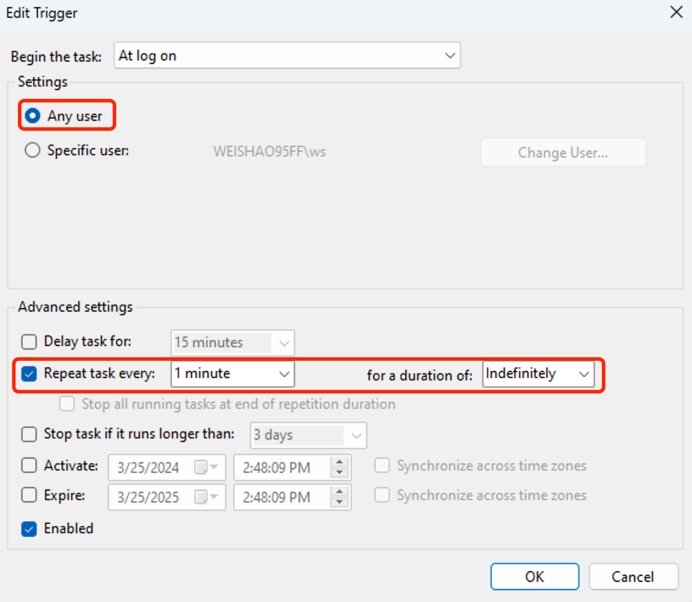
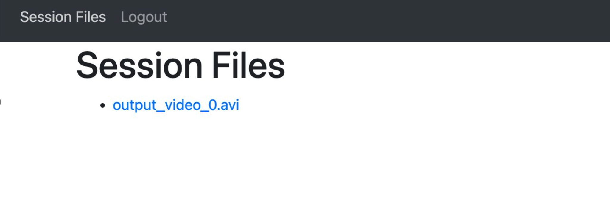

# Independent Study Report - Winter 2024

#### Prepared by: Wei Shao

#### Date: Mar 25, 2024

## Addressing Problems Brought up by Brittany

### Problem 1: Program Server Terminated

#### Description

Users are not technological experts, and sometimes they are not aware of the
server being accidentally terminated or crashed. Thus, we need to regularly
check the status of the server and restart it if not running.

#### Initial Proposed Solution

Add an interrupt handling feature that detects the termination of the server
(manually or due to an error) and then reboots the server.

#### Implemented Solution

Use Windows built-in
[Task Scheduler](https://learn.microsoft.com/en-us/windows/win32/taskschd/task-scheduler-start-page)
to maintain the server.

-   Set the server to run at any log on and set the highest privileges to
    prevent potential interruptions. 

-   Configure "Triggers" to make the computer repeat running the task every 1
    minute indefinitely. 

-   Configure "Settings" to make it an unique immortal process.
    
    **Reasoning:**
    Select **_“Allow task to be run on
    demand”_** for testing.\
    Select **_“Run task as soon as possible after a
    scheduled start is missed”_** to ensure the task is run in certain edge
    cases.\
    Deselect **_“If the task fails, restart every:”_** since it's not
    necessary; the computer will check the status of the task every 1 minute.\
    Deselect **_“Stop the task if it runs longer than:”_** and **_“if the task
    is not scheduled to run again, delete it after:”_** to ensure its
    immortality.\
    Deselect **_“if the running task does not end when requested,
    force it to stop”_** and set **_“If the task is already running, then the
    following rule applies: Do not start a new instance”_** to ensure its
    uniqueness.
-   Configure "Conditions" to disable any interruptions.
    

### Problem 2: Error Caused by Changes in Subject Name

#### Description

Customizing subjects’ names resulted in an error while reviewing recordings.

#### Initial Proposed Solution

Read the selected subject’s name from the corresponding BORIS file every time
the smartwatch triggers a recording.

#### Implemented Solution

Read the selected subject’s name from the corresponding BORIS file every time
changing the subject is triggered by the smartwatch, and pass the name to the
camera control program when recording starts.

-   Reading the subject name from the BORIS file
    [read_name()](https://github.com/YoungKameSennin/BeLOG-System/blob/75a051bc44e9a4a840611fe2a03f7b249895c6b8/Codes/BeLog_Linux.py#L16)
-   [Passing the subject name](https://github.com/YoungKameSennin/BeLOG-System/blob/75a051bc44e9a4a840611fe2a03f7b249895c6b8/Codes/BeLog_Linux.py#L119)
    to the camera control program.

## Switching from Mini-PC to Nvidia Jetson Nano

### Rebuilt Part of the Code

Since the Python `keyboard` module is not working with both Jetson Nano and
arm64 MacOS for unknown reasons, the code was rebuilt using the
`pynput.keyboard` module as suggested in this
[forum](https://stackoverflow.com/questions/69949923/python-keyboard-module-non-functional-with-python-3-x-and-macos).

The `pynput.keyboard` module also solves an issue with the python `keyboard`
module in our case, that it does not have a way to detect a "press and release"
keystroke. In the previous version, depending on the hit duration, one key input
might trigger the program to act several times.

[`pynput.keyboard.Hotkey`](https://pynput.readthedocs.io/en/latest/keyboard.html#global-hotkeys)
offers a solution to the problem mentioned above.

```
python
# Code Snippet
def switch_sub0():
    global subject
    global subject_name
    global rec
    subject = 0
    subject_name = read_name(subject)
    print_log(f"Changed to Subject{subject}: {subject_name}")
...
...
h = keyboard.GlobalHotKeys({
        '<ctrl>+<alt>+0': switch_sub0})
h.start()
```

### Using Regular Camera

To further reduce the size and cost of the whole setup, we decided to use a
regular camera instead of the Intel Realsense Depth Camera.

Depth data could potentially be obtained by using multiple cameras at different
angles. An IEEE paper on this topic is
[_Depth Estimation with Multi-camera Array_](https://ieeexplore.ieee.org/document/9935518).

### Testing

The rebuilt version is tested on arm64 MacOS (the same processor architecture as
Jetson Nano) and works without any issues. Further testing on Jetson Nano is
required.

## Webserver for Data Retrieving

Based on the [work](https://github.com/dmbr253/Theralog/tree/Web-Server) done by
Team 25 from the University of Kentucky, a [modified version](https://github.com/YoungKameSennin/BeLOG-System/blob/main/Webserver/main.py) is solely serving
for data retrieval. 

## Proposal for Getting Rid of BORIS

We are using BORIS as our primary tool for editing/coding recorded sessions. It
is usable, but still requires a bit of training, so our goal is to move away
from BORIS.

### Proposed Solution

 **(UI Wireframe)**

1. Playback\
Upon clicking on a recorded session, the webserver renders an HTML
   template:

```
// Pseudocode
<head>
    <meta charset="UTF-8">
    <title>Session Playback</title>
</head>
<body>
    <video width="720" controls>
        <source src="{{ url_for('static', filename='recording/recorded_session.mp4') }}" type="video/mp4">
    </video>
```

2. Event List\
The webserver will read recorded timestamps related to the session
   in the format where each piece of information is delimited by a comma, such
   as:

```
// timestaps.txt
00:00:05,Aggressive,start
00:02:00,Aggressive,stop
00:05:30,Sele-injury,start
...
```

and then create an array of buttons that jump the video playback to the
timestamp:

```
// Pseudocode
<body>
    
    <button onclick="jumpTo('{{ timestamp }}')">{{ label }}</button>
    

    <script>
        function jumpTo(timestamp) {
            // Convert timestamp to seconds
            const parts = convert_to_seconds(timestamp.split(':'));

            // Jump the video playback to the timestamp
            const video = document.getElementById('videoPlayer');
            video.currentTime = seconds;
            video.play();
        }
    </script>
</body>
```

To make modifications to the timestamps, we can incorporate another function:

```
<script>
    function updateTimestamp(index) {
        const timeInput = document.getElementById(`time${index}`);
        const newTime = timeInput.value;

        fetch('/update_timestamp', {
            method: 'POST',
            headers: {
                'Content-Type': 'application/json',
            },
            body: JSON.stringify({ index: index, time: newTime }),
        })
        .then(response => response.json())
        .then(data => {
            if(data.success) {
                alert(data.message);
            } else {
                alert(data.message);
            }
        })
        .catch((error) => {
            console.error('Error:', error);
        });
    }
</script>
```
